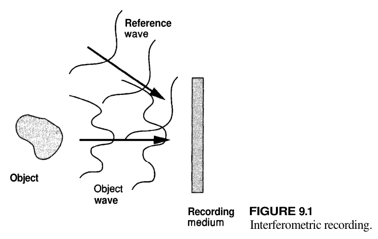

# Chapter 9

## 9.2 THE WAVEFRONT RECONSTRUCTION PROBLEM

### 9.2.1 Recording Amplitude and Phase

Recording media respond to light intensity, using *interferometry* technique to record phase information:

Two complex fields are:
$$
\text{Unknown field:}\quad a\left( {x,y} \right) = \left| {a\left( {x,y} \right)} \right|\exp \left[ { - i\phi \left( {x,y} \right)} \right]\\
\text{Reference field:}\quad A\left( {x,y} \right) = \left| {A\left( {x,y} \right)} \right|\exp \left[ { - i\psi \left( {x,y} \right)} \right]
$$
The intensity of sum is 
$$
I\left( {x,y} \right) = {\left| {A\left( {x,y} \right)} \right|^2} + {\left| {a\left( {x,y} \right)} \right|^2} + 2\left| {A\left( {x,y} \right)} \right|\left| {a\left( {x,y} \right)} \right|\cos \left[ {\psi \left( {x,y} \right) - \phi \left( {x,y} \right)} \right]
$$

### 9.2.2 The Recording Medium
Assume that the variations of exposure in the interference pattern remain within a linear region of the $t_A$ vs. $E$ curve.